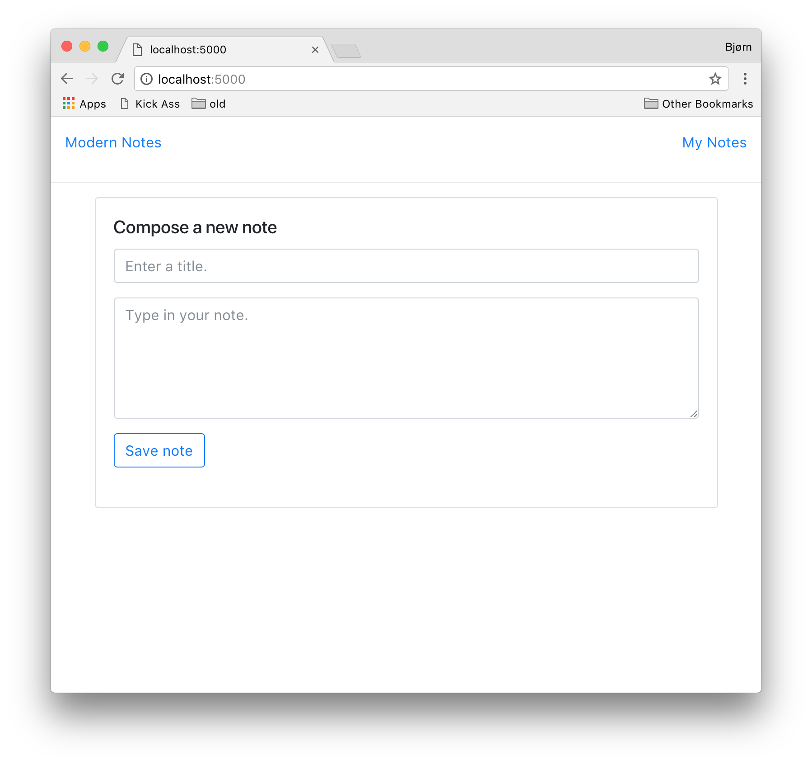

# Modern Notes
Modern Notes example solution. Simple web app for composing plain text notes.
Users can view, edit and delete notes. In addition to the front-end user
interface it has backend REST API. The API is documented [here](#).



We use an in-memory database for storing notes. Restarting the web app will
delete any previously written notes.

# Online Example
The Modern Notes app is available at
[http://ec2-35-158-119-192.eu-central-1.compute.amazonaws.com](ec2-35-158-119-192.eu-central-1.compute.amazonaws.com).

# Build and run  
You can build and run the Modern Notes example solution by running
```
dotnet run
``` 
in this folder. The app should now be available in your web browser at
[localhost:8000](http://localhost:8000). This requires the [.NET
SDK](https://www.microsoft.com/net/download).

## Docker
A Docker image of the application is available online (for users without the .NET SDK installed). 

```
docker run -p 8000:80 -t fjukstad/modernnotes
```

The app should now be available at [localhost:8000](http://localhost:8000).
You can also build and run the image by running

```
docker build -t modernnotes .
docker run -p 8000:80 -ti modernnotes
```

in this folder.  